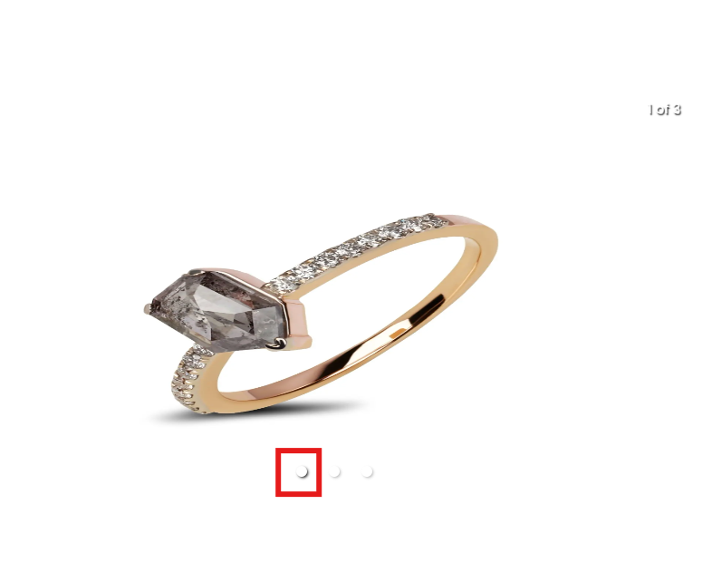
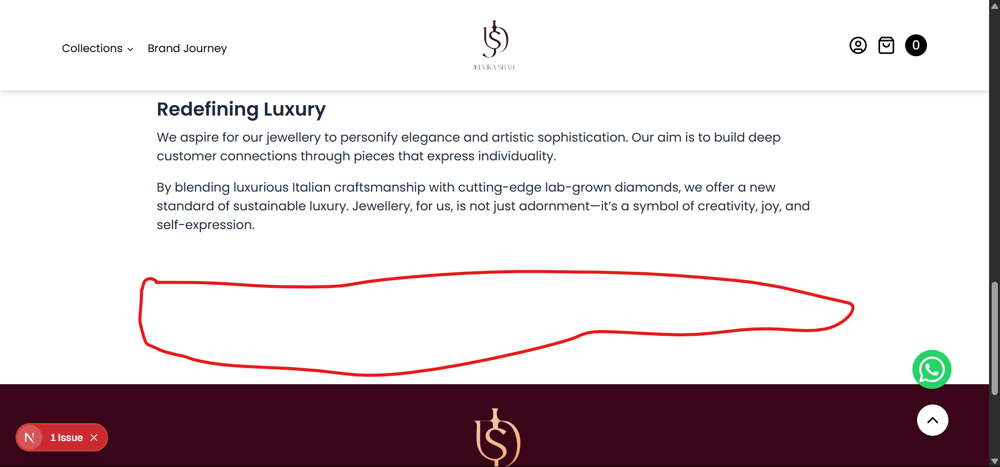
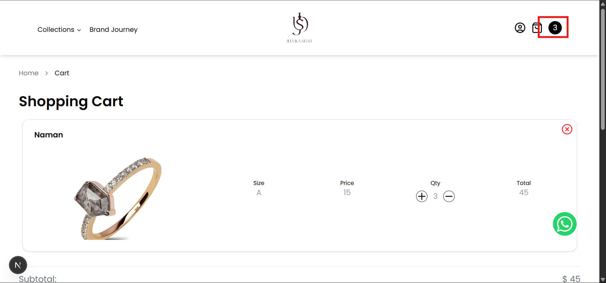
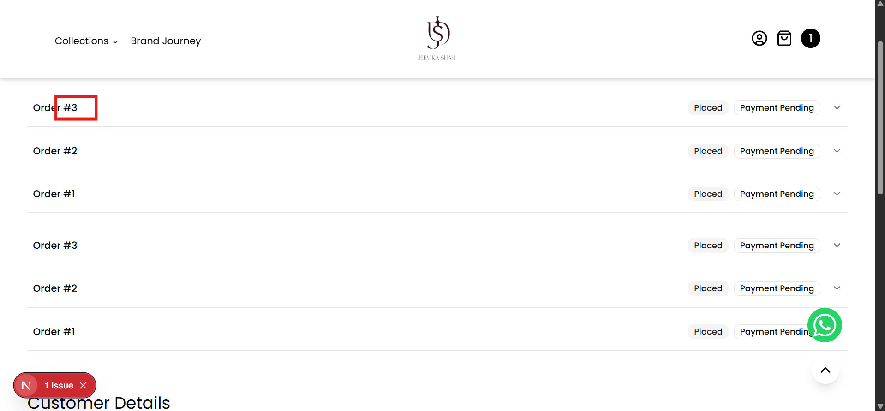
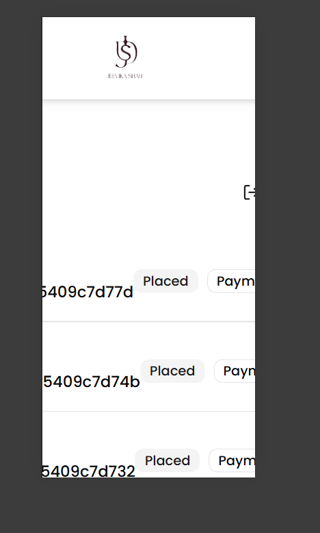
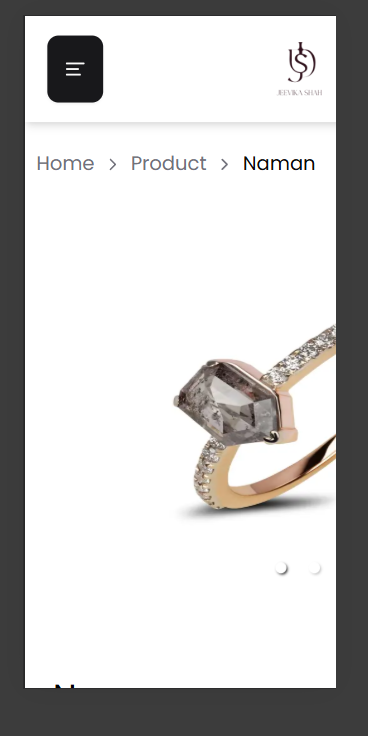

# jeekika-shah-jewellery-frontend
The frontend web application for e-commerce of gold and diamond jewellery.

List of tasks:

- [x] Add the tabs in product page, and remove from collections page
- [x] Improve the navbar drawer style
- [x] add the Cart drawer
- [x] add the profile page
- [x] add the checkout page
- [x] Integrate the razorpay checkout
- [x] Add the whatsapp link
- [x] After the APIs are provided, integrate them.
- [x] Navigate to home on clicking the logo
- [x] Add filters on collections page. See the reference website
- [x] Try to use the burgandy logo everywhere. If not possible everywhere, then use it wherever the background is white
- [x] Remove explore options from Product Card and remove the Modal as well
- [x] Change footer background color to burgandy
- [x] Add breadcrumbs on top
- [x] Recuce the font weight on the product page. Use lighter fonts everywhere
- [x] Add some gaps between the plus and minus buttons and the quantity on the product page
- [x] Add to cart button is not there on product page
- [x] How will you display previous orders?
- [x] Add a page for order details
- [x] Email is an optional field, so add a check to see if it exists. Make it optional in the interface as well.
- [x] Make the entire Product Card a link i.e. customer should be directed to the product page on clicking anywhere on the card, not just on the title.
- [x] Shop Now button on cart page when cart is empty should navigate to the all products page.
- [x] On policy pages, center the title, add some bottom margin to the title and increase the line height of the content.
- [x] In mobile view, when the menu bar is open, on clicking on any item, menu bar should collapse.
- [x] Make page for `/collections/all`.
- [x] In Collections in navbar, "Shop All" is missing
- [x] On the login page, shift the logo to center.
- [x] On the signup page, add input for address line 2
- [x] In the product response, there is "suggestions". Use those products in "You May Also Like".
- [x] On the product page, for the active image, make the selector black so that it is more evident. 
- [x] Reduce this space on brand journey. Same issue on policy pages 
- [x] In the mobile menu, add an option to navigate to Profile Page.
- [x] Default size should be the first size on the product page
- [x] On the landing page in the categories section, clicking on the photo of any 1 category should navigate to products of that category.
- [x] On the landing page, clicking on the View All should navigate to all products.
- [x] Update the policies as discussed.
- [x] The number indicator besides cart icon is not showing a correct number. It is showing the total quantity, but it should show the number of products. For e.g., if I add 3 quantity of 1 product, it should show 1, not 3. 
- [x] The minus button on cart is removing the product from cart. It should reduce the quantity by 1. If the quantity is 1, only then it should remove from cart.
- [x] Remove the text "Taxes and shipping calculated at checkout." from cart.
- [x] Show the diamond type selected on cart page.
- [x] On the checkout page, when ordering for someone else, take input of name and phone as well.
- [x] Clear the cart once order is placed.
- [x] Display order total on the profile page where all orders are shown.
- [x] All prices are in INR, so should be displayed with the rupee symbol.
- [x] Here order._id should be displayed. 
- [x] User's mobile is not displaying in Customer Details
- [x] On the Checkout page, it is still USD.
- [x] In page.tsx, line no. 46, add the logic to check if last name exists before the div i.e. on line 44 so that the title "Last Name:" is also not displayed if last name doesn't exist.
- [x] In address line2 is also optional. So the comma after line2 should come only if line2 exists. Make it optional in the interface as well.
- [x] Scorlling issue there on profile page. 
- [x] Add a functionality on the Enter OTP page to scroll to top.
- [x] This issue is there everywhere where an image is being displayed. 
- [x] Size should be a drop-down menu and it should only show the displayName property, not the weightOfMetal. weightOfMetal is for internal use
- [x] In mobile view, on clicking the Profile button, menu bar is not collapsing
- [x] On the product page, implement zoom on hover for images
- [x] The currency is filter is dollar. Make it INR and add commas.
- [ ] In the filter, set the maximum to 7,00,000.

Flow for user authentication:
Login:
1. Take input for mobile number.
2. Check if user exists or not.
3. Call the API: /user/send-otp (Send OTP) with the mobile number.
4. Take input for the OTP.
5. Call the API /user/verify-otp (Verify OTP) with the mobile number.

Register:
1. Take all the user inputs.
2. Check if user exists or not.
3. Call the API: /user/send-otp (Send OTP) with the mobile number.
4. Take input for the OTP.
5. Call the API /user/verify-otp (Verify OTP) with all user details.

Flow for order creation:
1. After the checkout page, on clicking a button like "Pay Now", first call the API: /order/create (Create Order) with the products payload. (No need to send the price of products here).

2. If order creation fails, then redierect user to the Order Confirmation page and display a message that "Order could not be created, please try again later".

3. If order creation is successful, then call the API: /razorpay/create-order (Create Razorpay Order) with the _id received from the response of order creation.

4. If Razorpay order creation fails, then redierect user to the Order Confirmation page and display a message that "There was an error completing the payment. Don't worry your order has been successfully placed, you can complete your payment here".

5. If the Razorpay Order creation is successful, then in the callback method of Razorpay, call the API: /razorpay/verify-signature (Verify Signature).

6. If Signature Verification fails, then redierect user to the Order Confirmation page and display a message that "There was an error completing the payment. Don't worry your order has been successfully placed, you can complete your payment here".

7. If the signature verification is successful, then update payment details of the order by calling the API: /order/update-payment/:orderId, with the Razorpay Payment ID.

8. Redierect user to the Order Confirmation page, send confirmation by calling the API: /order/send-confirmation/:orderId (Send confirmation) and display a message that "Thank you for shopping with us! Your order has been placed successfully".

Note: Display the messages on the order confrimation page in a simple and easy-to-the eye manner
